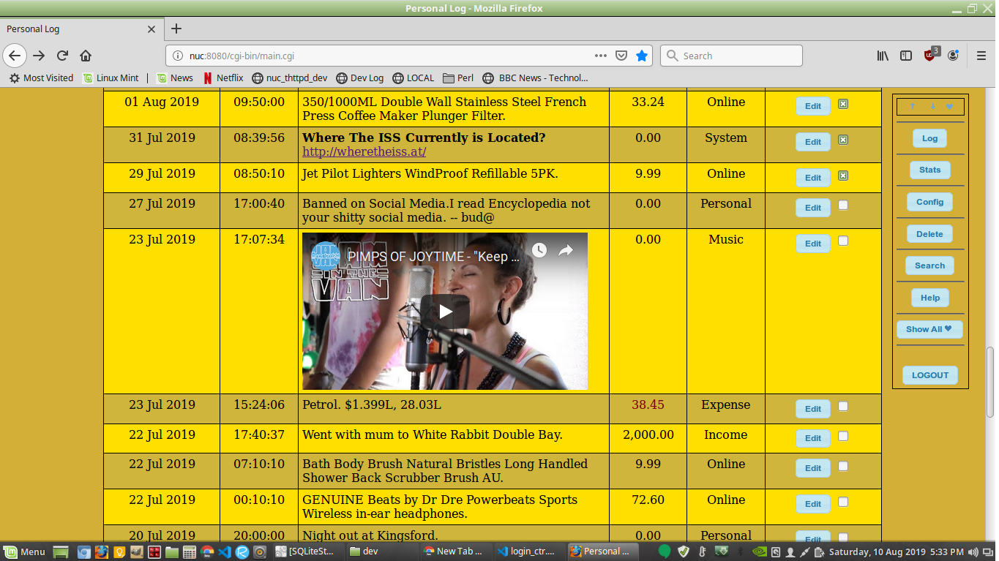

# Life Log

Web Application that keeps an everyday CGI accessible log of database entries of various categories.
Preferably on a small inexpensive server connected to your local network.

Written in Perl, easy to implement and modify.

Latest stable version is **2.4** in **SUN** stage.

## PC Requirements

* Any Operating System
* Processor 1.2+ GHZ or better, 2+ cores.
* Only 2 GB+ physical.

Setup is requiring some Perl knowledge to install and enable, and tweak this application. The main application sources are located in the ../htdocs/cgi-bin directory.

### Quick Setup

* After downloading this application and installing in a directory (default is **~/dev**), which both can be done with:
  * ```git clone https://github.com/wbudic/LifeLog.git```
    * Check here for further [instuctions](./Installation.txt).
  * Before modifying any configuration, run the module installation and testing process.
    * ```./install_modules.sh```
    * This might be necessary after even upgrades.
    * Upgrades support preserving of data, and migration to any possible new data structures, automatically.
    * Rolling back to an previous version even if not expected, it is not affected by any new modules you might have installed, down the track.

## What is the purpose of having this log kept?

Here are some things that come to mind:

* Allows you to keep an organized historical log of every day and time events.
* All logs are categorized, easy to search, view modify.
* Only latest and last entries are listed of the current, which usually is of interest.
    ** Special log entries can be made sticky on top to be listed, and in future dated logs can be added, for what ever reason or flow.
* Fast search based on categories, keywords, from to date, all integrated.
  * Historical view of data as such is not cluttered by none relevant log entries. Which is a common problem in spreadsheets.
  * Export/DateDiff/Print selected log entries.
  * Need to compare current purchase, with any last times of the same. Be it in days or cost, total of the expense? Now you can.
* Optionally assign accounting values to log entries, is it an asset, income or expense?
  * These are per page calculated.
  * View through the static page your logged current income and expense, for the current year.
    * Your Expense there is of interest. No?
      * Statics page also gives you runtime information of your server and log.  
* RTF documents can be attached to an log.
  * These range from simple to further more styled documentation of the log entry.
  * Web snippets can be copied and pasted. The Reach Text Format is real a document object, stored in one place, with others.
  * Images added to RTF can be links or virtually embedded, making it part of you db type file.
* Having an vast historical log, it is easy to backup and transport.
* To access the log, security is applied based on alias.
  * Backup and Restore is user or alias specific, so it is not possible to restore from another alias db into yours, to view data.
  * Backup is inbuilt, you make one, if unsure if deleting and rampaging and exploring with the log, might make you loose data.
  * Each alias creates its own log database, so if working on something specific, this you use to that by alias separately can access/share.
    * In turn this database configuration can have its own list of categories, it is independent.
    * All is unique and configurable in its own instance. Defaults are provided by this applications in an custom unique fast configuration file system.
      * i.e. The main.cnf is used with own bummed configuration parsing routines, all part of this applications program, you have the code.
      * The configuration system here is rare. As it takes into account three states of preservation of concerns.
        1. System and application provided default. (Application release defaults, gets overridden on app code update.)
        2. Application own default. (Application in code provided defaults, has someone deleted/damaged the text config file?)
        3. User set configuration. (Application, user set, added, amended in database configuration, must be preserved on software or release update.)
* Interaction and configuration is user friendly, provided in the interface, no need to access a server located main.inf file, for most parts.
* Data migration on software updates are automatically provided.
  * Data structures and footprint is tiny.
  * Amount of data a log can contain is unlimited.
    * You only browse in a small view sections of it.
* Data is stored in a standard SQL based database.
  * System admins, database developers, managers, large or small; will find this useful in case they need to do something with it, in the future or current situation.
  * Web developers with no Perl coding skills, can access and modify the HTML containing .cgi files and modify them as needed, for simple edits.
    * All relevant *perl code* and HTML is in one file per web page, shared settings, configuration, session, parameter names, constance's, in one place, not scattered around in several files.
* **Perl** is used to deliver the pages and all the interaction.
  * It is being interpreted using libraries that directly link to fast system routines.
    * Nothing unnecessary is loaded or searched for, to provide execution on the fly.
    * There is no waste on reference to reference in memory, referencing an instance, that references the actual address.
    * You don't need virtual machine loading, path resolving, then encapsulated traverse on complex object structure being created, to start the program execution. However, it is necessary unfortunate, that other languages have to do that.

## Life Log version v.2.+

* Mulitple SQL database support ready and tested, currently PostgreSQL, LightSQL (default).
* Data searches, views, updated, enhanced and upgraded.
* Migration upgraded and test.
* Cross version releases, automatic migration of data and structures.
* Tested and provided also now installation instruction for HTTPS based webserver lighty.
* Tested and working now on ubuntu, debian and mint distros.
  
## Life Log version v.1.8

* Automated install module script **`./install_modules.sh`**
* Has Secure Backup/Restore. Providing accurate full data restore and merging with existing for live databases.
* Now with a distinct data page and view mode.
* New category selection, storing approuch.
* Better and more efficient application configuration and setup.
* Numerous fixes, and better exception handling.

## Life Log version 1.7

* Views updated, having option to exlude by category now, during the session logging.
* New system configuration options. i.e. $DEBUG for some sql statements.
* Server system based snapshot logs, on stats invocation.
* Server indentifier on login.

## Life Log version 1.5+

* Ritch Text Documents can be attached to Logs.
* Theme support. Change the look and feel. From the congiguration page.
* Expenses and Income totals, various new calculations.
* LTags inclusion, format and output better information.
* Better interactivity.




