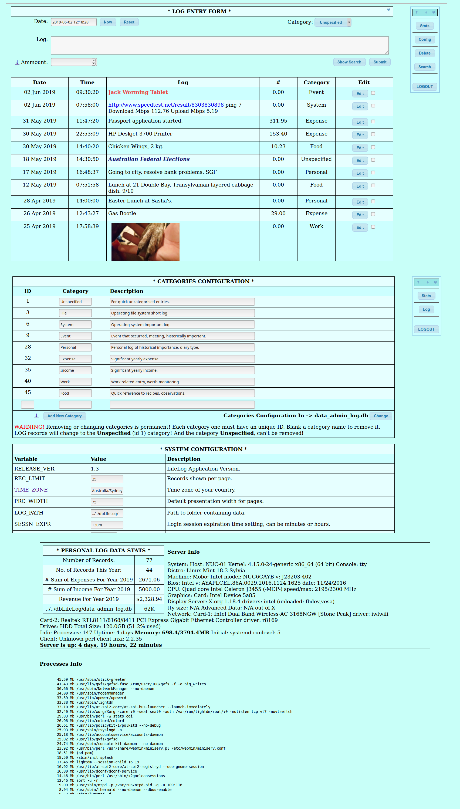

# LifeLog

Latest 1.5 ver. is in dev. Branch. Not release ready. This week.

Web Application that keeps an everyday CGI accessible log of database entries of various categories.
Preferably on an small inexpensive server connected to your local network.

Written in Perl, easy to implement and modify.

Currently it is in version 1.4 moon-stable release stage, requiring some Perl knowledge to install and enable, tweak.
The main application sources are located in the ../htdocs/cgi-bin directory.

https://www.sqlite.org/index.html database is required to run this web application.

## Important SQLite update arraived, 19-Jun-2019. Full on security patches, on buffer over., Denial of Service attacks. Etc. If placing this application on the internet.

