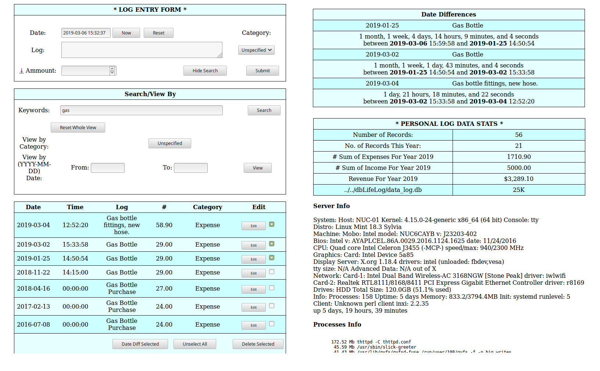

# LifeLog

Web Application that keeps an everyday CGI accessible log of database entries of various categories.
Preferably on an small inexpensive fanless server connected to your local network.

Written in perl, easy to implement and modify.

